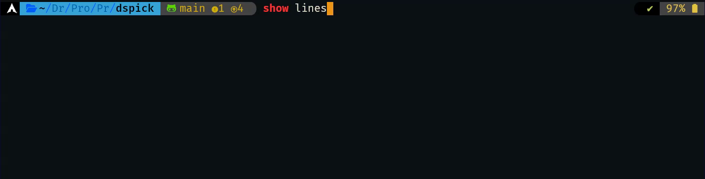

# DsPick

AI Shell Completions:

Like Navi, but with DSPy under the hood.\
Ask, Get a CLI command, Done.

## Usage

Describe the desired action and press the shortcut (default `ctrl+g`).

Demo:


Multiple commands completion:
(in the example `sum numbers`→`paste -sd+ | bc`)


Language support:
(Depending on the LLM)


Sometimes it fails:
(`$9` instead of `$11` or `$NF`)


## Installation

Load `dspick` in your shell.

bash:
```bash
source dspick.bash
```

zsh:
```shell
source dspick.zsh
```

Create a `.env` file with your LLM provider API Keys.
(Not required if using Ollama.)

```
ANTHROPIC_API_KEY=xxxxxx
GOOGLE_API_KEY=xxxxxx
GROQ_API_KEY=xxxxxx
MISTRAL_API_KEY=xxxxxx
OPENAI_API_KEY=xxxxxx
...
```

## Configuration

Manual: `config.toml`\
Or execute the config tool:

```bash
dspick config
```


Models:


Options:

- **Cache**: LLM responses will be cached.
- **Throttling**: Enable limit `request per minute` to avoid LLM Quotas.

## Optimize

The optimizer tool improves result accuracy by generating an optimized.pkl file.\
This file is **automatically used if present**.

DSPy can refine prompts and examples to improve LLM responses. The optimization method may vary depending on the LLM being used.

- **Resumable Process**:  Can be restarted if interrupted and some steps completed successfully.

- **Throttling**: Handles rate limits efficiently (see Throttling).


To run the optimizer:
```bash
dspick optimize
```


##### Accuracy improvements:

