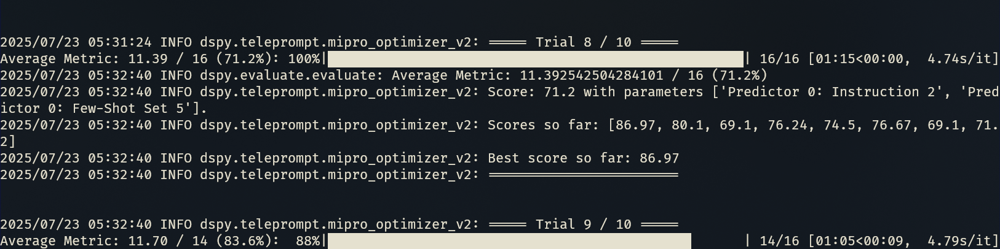

# DsPick

AI Shell Completions:

Like Navi, but with DSPy under the hood.\
Ask, Get a CLI command, Done.

Generates CLI commands from natural language descriptions.

- Can generate multiple commands in sequence.

- It's context-aware, considering previous commands in the pipeline.

- Provides multilingual support depending on the LLM use.

- Compatible with major providers like OpenAI, Gemini, Anthropic, and Ollama.

- Includes an optimizer to refine accuracy.

- Rate limits to manage API quotas.

- Configurable via interactive tool or config file.


## Usage

Describe the desired action and press the shortcut (default `ctrl+e`).

Demo:


Multiple command completion:\
(in the example `sum numbers`→`paste -sd+ | bc`)


Language support:\
(Depending on the LLM)


Sometimes it fails:\
(`$9` instead of `$11` or `$NF`)


## Installation

Permissions:
```bash
chmod +x dspick
```

(Maybe) Add to path
```
ln -s "$(pwd)/dspick" ~/bin/
# or .local/bin
ln -s "$(pwd)/dspick" ~.local/bin/
```


Load `dspick` in your shell.

##### bash:

Load
```bash
source $(dspick bash)
# or in the same directory
source dspick.bash
```

Or add to .bashrc

```bash
if [ -x "$(command -v dspick)" ]; then
	source "$(dspick zsh)"
fi
```

##### zsh:

Load
```shell
source $(dspick zsh)
# or in the same directory
source dspick.zsh
```

Or add to .zshrc

```bash
if [ -x "$(command -v dspick)" ]; then
	source "$(dspick zsh)"
fi
```

##### fish:

Load
```shell
source $(dspick fish)
# or in the same directory
source dspick.fish
```

#### API Keys

Create a `.env` file with your LLM provider API Keys.\
(Not required if using Ollama.)

```shell
ANTHROPIC_API_KEY=xxxxxx
GOOGLE_API_KEY=xxxxxx
GROQ_API_KEY=xxxxxx
MISTRAL_API_KEY=xxxxxx
OPENAI_API_KEY=xxxxxx
...
```

## Configuration

Manual: `config.toml`\
Or execute the config tool:

```bash
dspick config
```


Models:


Options:

- **Cache**: LLM responses will be cached.
- **Throttling**: Enable limit `request per minute` to avoid LLM Quotas.

## Optimizer

The optimizer tool improves result accuracy by generating an optimized.pkl file.\
This file is **automatically used if present**.

DSPy can refine prompts and examples to improve LLM responses. The optimization method may vary depending on the LLM being used.

- **Resumable Process**:  Can be restarted if interrupted and some steps completed successfully.

- **Throttling**: Handles rate limits efficiently (see Throttling).


To run the optimizer:
```shell
dspick optimize
```

##### Training (with rate limit):



##### Accuracy improvements (gemini-2.5-flash-lite-preview-06-17):


